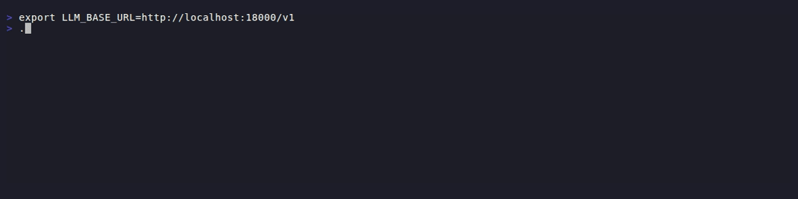

# SAIA: SCUMM for AI Agents

You tell the LLM "verify this claim and explain why." It returns prose. Now you're parsing strings,
hoping it followed your format. SAIA gives you `verify()` - it returns `{passed: bool, reason:
str}`.

SCUMM (1987) reduced adventure games to a fixed set of verbs. The original Monkey Island used 12;
later releases refined this to 9: Open, Close, Push, Pull, Give, Pick up, Look at, Talk to, Use.
Every puzzle was built from these primitives. The constraints didn't limit the games - they enabled
them. Designers knew exactly what players could do.

SAIA applies the same idea to LLM agents. `verify()` returns pass/fail with reason. `critique()`
returns weaknesses. `decompose()` returns subtasks. The structure follows from the operation.

**Prompts are suggestions. Verbs are structured contracts.**



In practice:

```python
saia = SAIA.builder().backend(backend).build()

result = await saia.verify(generated_code, "no SQL injection vulnerabilities")
# result.passed = False, result.reason = "User input concatenated directly into query"

critique = await saia.critique(llm_response)
# critique.weaknesses = ["Claims unsupported by sources", "Contradicts earlier statement"]

fixed = await saia.refine(llm_response, critique.weaknesses)
```

## The Verbs

- **verify** - check a predicate -> `{passed: bool, reason: str}`
- **critique** - find weaknesses -> `{weaknesses: list[str]}`
- **decompose** - break into subtasks -> `list[str]`
- **extract** - pull structured data -> your schema
- **synthesize** - combine inputs -> structured output or text

Plus `ask`, `refine`, `classify`, `choose`, `constrain`, `ground`, `instruct` - see
[docs](../README.md).

## Example

```python
from llm_saia import SAIA

saia = SAIA.builder().backend(anthropic_backend).build()

# Break down, execute, combine
subtasks = await saia.decompose("Build a web scraper")
results = [await saia.instruct(t) for t in subtasks]
output = await saia.synthesize(results, goal="single working Python script")
```

## The Loop Controller

Verbs handle single calls. `complete()` handles multi-step agent loops with tools.

```python
result = await saia.complete("Analyze the files in /src and summarize")
# result.output = "The src directory contains..."
# result.iterations = 4
```

It detects degenerate states (LLM repeating itself, contradicting itself, asking permission) and
either nudges back on track or terminates via a designated tool. Agents that actually finish.

## What You Get

- **Zero runtime dependencies** - pure Python core, bring your own LLM client
- **Swap backends freely** - Anthropic, OpenAI, Ollama, vLLM with one line change
- **~2500 lines total** - easy to understand, minimal structures, fork it if you want
- **No lock-in** - use inside any orchestrator, any framework

## How is this different?

**Instructor** extracts. **SAIA** orchestrates.

Instructor validates structured output from a single LLM call. SAIA runs multi-step agent loops
with tools, state detection, and graceful termination.

**LangChain** is a framework. SAIA is ~2500 lines you plug into anything.

**Native structured outputs** give you shape. SAIA verbs give you shape *and* the prompt that
produces it.

## Part of an agent framework

SAIA is the semantic layer extracted from a production agent stack for 24/7 autonomous agents:
- **llm-agent** - agent orchestration platform
- **llm-saia** - semantic actions (this library)
- **llm-learn** - training / tuning framework
- **llm-infer** - inference backends and routing
- **appinfra** - shared infrastructure (logging, config, cli, database)

## Links

[github.com/serendip-ml](https://github.com/serendip-ml)
